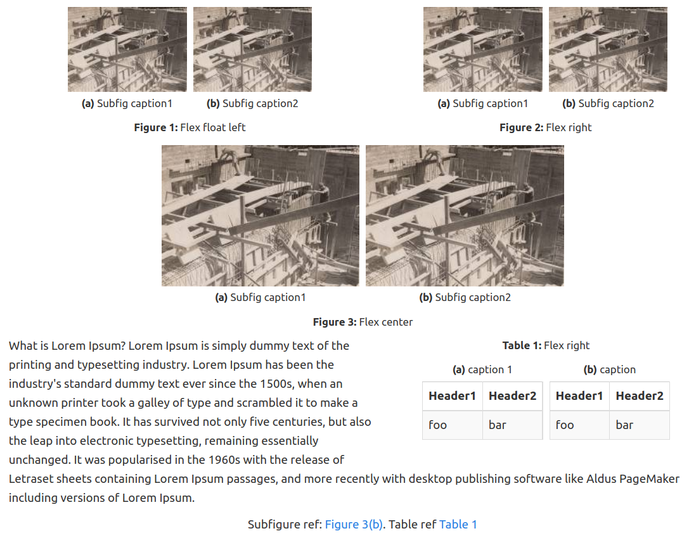
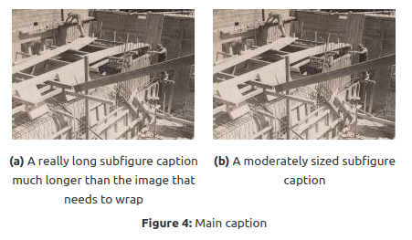

# latexcaption plugin for DokuWiki

Adds syntax for latex-like figure captions and numbering

All documentation for this plugin can be found at
https://github.com/bennvan/dokuwiki-plugin-latexcaption


Originally forked from Till Biskup and mostly re-written. New repo due to change in syntax. 
https://github.com/tillbiskup/dokuwiki-caption


Fixes: 
- No string searches to set reference links that appear before a label definition.
- Change syntax to allow multiple classes to be used eg. left, center, right.
- Add ability to have subfigures/tables.
- Add option to change caption tag syntax.
- Code easy to expand to caption label more tags if needed.
- Updated some css styles to use flexbox.

The following outputs are using the bootstrap3 template. Please note that the `<caption></caption>` syntax conflicts with bootstraps' caption. I recommend to modify the boostrap3 syntax to use something like `<bscaption></bscaption>`, or alternatively I have provided a setting to change the syntax of this plugin. 

Example output:
-------------




New Syntax/ Example:
-------------

 - Currently supported blocks to caption are: `figure`, `subfigure`, `table`, `subtable`, `codeblock`, `fileblock`. 

```
<figure opts| fig_label>
 <subfigure opts| subfig_label1>
	{{image1.jpg?direct&200}}
	<caption>Subfig caption1</caption>
 </subfigure>
 <subfigure opts| subfig_label2>
	{{image2.jpg?direct&200}}
	<caption>Subfig caption2</caption>
 </subfigure>
 <caption>Main caption</caption>
</figure>
```

Options:
------------

 - Alignment classes: `left`, `center`, `right`, `even`.  `even` may only be used with figures.
 - No colon: `blank`. Use this if you dont want to print a ':' after the figure number.

If you want to apply your own css stying to the figures. Any option input are added as a class in the form `plugin_latexcaption_{option}`.


Example with centering and caption number only:

```
<figure center blank>
 {{image1.jpg?direct&200}}
 <caption></caption>
</figure>
```

Example subfigure with a long caption:
```
<figure center>
 <subfigure>
 	{{image1.jpg?direct&200}}
 <caption>A really long subfigure caption much longer than the image that needs to wrap</caption>
 </subfigure>
 <subfigure>
	{{image2.jpg?direct&200}}
 <caption>A moderately sized subfigure caption</caption>
 </subfigure>
 <caption>Main caption</caption>
</figure>
```

This gives the output:



In text referencing:
-------------
```
{{ref>label}}
```
Warning: References may render unexpected results if your labels are not unique across all figures, subfigures, tables etc.!

Set counter:
-------------

You can set the counter to any integer value at any point on the page. 

```
<!-- Set the figure counter to 5 -->
{{setcounter figure=5}} 

<!-- Set the table counter to 3 -->
{{setcounter table=3}} 
```

-----

If you install this plugin manually, make sure it is installed in
lib/plugins/latexcaption/ - if the folder is called different it
will not work!

Please refer to http://www.dokuwiki.org/extensions for additional info
on how to install extensions in DokuWiki.

----
Copyright (C) Ben van Magill <ben.vanmagill16@gmail.com>

This program is free software; you can redistribute it and/or modify
it under the terms of the GNU General Public License as published by
the Free Software Foundation; version 2 of the License

This program is distributed in the hope that it will be useful,
but WITHOUT ANY WARRANTY; without even the implied warranty of
MERCHANTABILITY or FITNESS FOR A PARTICULAR PURPOSE.  See the
GNU General Public License for more details.

See the LICENSING file for details
